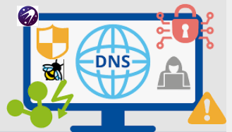
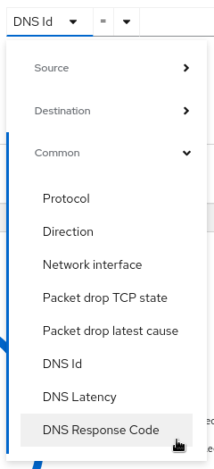
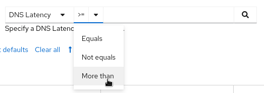
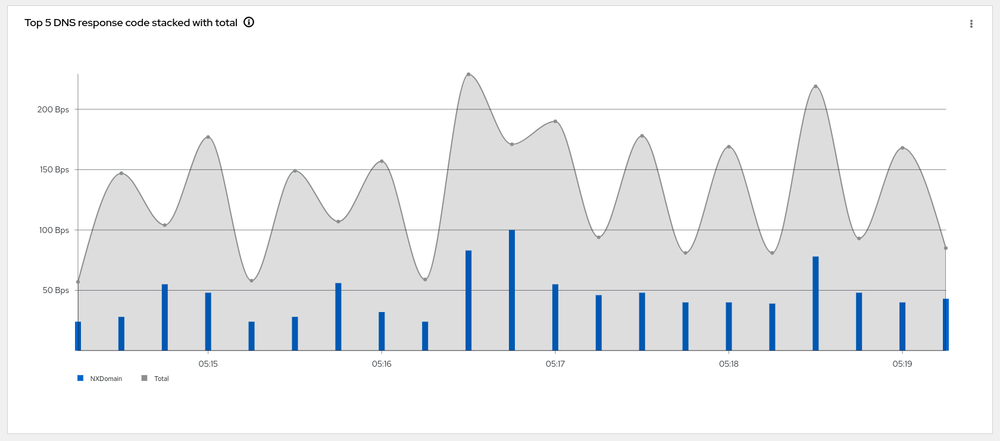
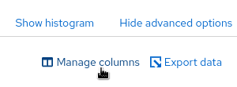
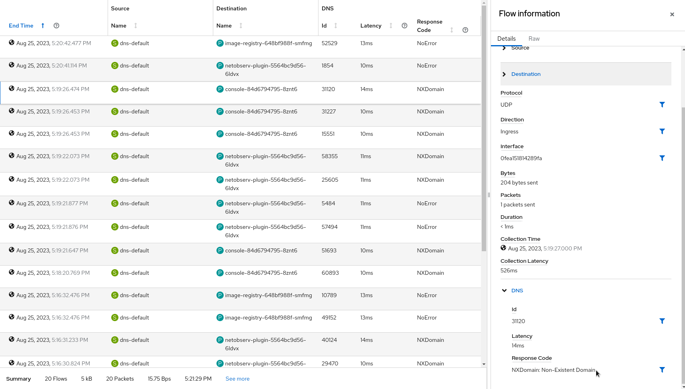

# Network Observability Per Flow DNS tracking



By: Julien Pinsonneau, Mehul Modi and Mohamed S. Mahmoud

In today's interconnected digital landscape, Domain Name System (DNS) tracking
plays a crucial role in networking and security. DNS resolution is a fundamental
process that translates human-readable domain names into IP addresses, enabling
communication between devices and servers. For operations excellence, DNS
resolution benefits from monitoring and analysis, which can be achieved through
innovative technologies like eBPF (extended Berkeley Packet Filter). In this
blog post, we'll delve into the world of DNS tracking using eBPF tracepoint
hooks, exploring how this powerful combination can be used for various purposes,
including network monitoring and security enhancement.

## Understanding DNS Resolution

Before diving into the specifics of eBPF tracepoint hooks, let's briefly recap
how DNS resolution works. When you enter a website's domain name, such as
www.example.com, in your browser, your computer needs to find the corresponding
IP address. This process involves multiple steps, including querying DNS
servers, caching responses, obtaining the IP address to establish a connection
and caching response for future re-occurrence of the same DNS query.

## Utilizing Tracepoint Hooks for DNS Tracking

Tracepoint hooks are predefined points in the Linux kernel where eBPF programs
can be attached to capture and analyze specific events. For DNS tracking, we
leveraged tracepoint hooks associated with DNS resolution processes,
specifically the `tracepoint/net/net_dev_queue` tracepoint. Then we parse the
DNS header to determine if it is a query or a response, attempt to correlate the
query or response with a specific DNS transaction, and then record the elapsed time
to compute DNS latency. Furthermore, DNS network flows are enriched with DNS-related
fields (id, latency and response codes) to help build graphs
with aggregated DNS statistics and to help filtering on specific fields for display
in the Network Observability console.

## Potential Use Cases

DNS tracking with eBPF tracepoint hooks can serve various purposes:

- Network Monitoring: Gain insights into DNS queries and responses, helping
  network administrators identify unusual patterns, potential bottlenecks, or
  performance issues.

- Security Analysis: Detect suspicious DNS activities, such as domain name
  generation algorithms (DGA) used by malware, or identify unauthorized DNS
  resolutions that might indicate a security breach.

- Troubleshooting: Debug DNS-related issues by tracing DNS resolution steps,
  tracking latency, and identifying misconfigurations.

## How to enable DNS tracking

By default DNS tracking is disabled because it requires `privileged` access. To
enable this feature we need to create a flow collector object with the following
fields enabled in eBPF config section as below:

```yaml
apiVersion: flows.netobserv.io/v1beta1
kind: FlowCollector
metadata:
  name: cluster
spec:
  agent:
    type: EBPF
    ebpf:
      privileged: true
      features:
        - DNSTracking
```

## A quick tour in the UI

Once the `DNSTracking` feature is enabled, the Console plugin will automatically
adapt to provide additional filters and show informations across views.

Open your OCP Console and move to `Administrator view` -> `Observe` ->
`Network Traffic` page as usual.

Three new filters, `DNS Id`, `DNS Latency` and `DNS Response Code` will be
available in the common section:



The first one will allow you to filter on a specific DNS Id (found using `dig`
command or in flow table details) to correlate with your query.


The second one helps to identify potential performance issues by looking at DNS
resolution latency.



The third filter surfaces DNS response codes, which can help detect errors or
unauthorized resolutions.


### Overview

New graphs are introduced in the `advanced options` -> `Manage panels` popup:


- Top X average DNS latencies
- Top X DNS response code
- Top X DNS response code stacked with total




### Traffic flows

The table view adds the new DNS columns `Id`, `Latency` and `Response code`,
which are available from the `advanced options` -> `manage columns` popup.



The DNS flows display this information in both the table and the side panel:



## Future support

- Adding tracking capability for mDNS

- Adding support for DNS over TCP

- Investigating options to handle DNS over TLS where the DNS header is fully
  encrypted.
