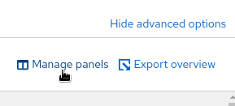
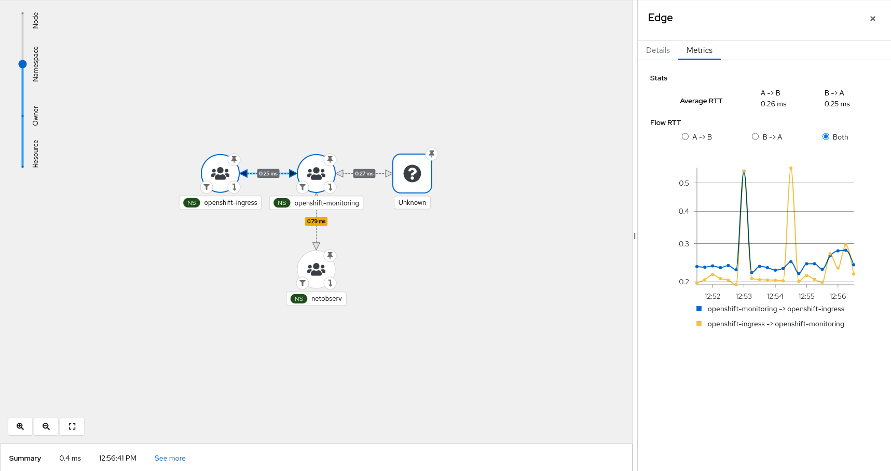

# Network Observability TCP Handshake Round Trip Time Developer Preview


By: Dushyant Behl and Julien Pinsonneau

In OCP ensuring efficient packet delivery is crucial for maintaining smooth
communication between applications. However, due to various factors such
as network congestion, misconfigured systems, or hardware limitations,
connections may become slow, impacting overall performance.
Round Trip Time (RTT) is the duration, measured in milliseconds, from when
a client sends a request to when it receives a response from a server.
Mesuring RTT is important for monitoring network health and diagnosing issues.

## RTT calculation using eBPF

// TODO: Explain how RTT is captured and calculed using time diffs
// between initial SYN & ACK packets using flow_monitor hookpoint
// Maybe also explain which are the limitations ?

## Potential Use Cases

Flow RTT capture from eBPF `flow_monitor` hookpoint can serve various purposes:

- Network Monitoring: Gain insights into TCP handshakes, helping
  network administrators identify unusual patterns, potential bottlenecks, or
  performance issues.

- Troubleshooting: Debug TCP-related issues by tracking latency and identifying
  misconfigurations.

## How to enable RTT

To enable this feature we need to create a flow collector object with the following
fields enabled in eBPF config section as below:

```yaml
apiVersion: flows.netobserv.io/v1beta1
kind: FlowCollector
metadata:
  name: cluster
spec:
  agent:
    type: EBPF
    ebpf:
      sampling: 1
      features:
        - FlowRTT
```

Sampling 1 will ensure we capture both SYN and ACK packets to calculate RTT.

## A quick tour in the UI

Once the `FlowRTT` feature is enabled, the OCP console plugin automatically adapts
to provide additional filter and show information across Netflow Traffic page views.

Open your OCP Console and move to
`Administrator view` -> `Observe` -> `Network Traffic` page as usual.

A new filter, `Flow RTT` is available in the common section:


It will allow you capture any flow having a RTT more than a specific time in nanoseconds.

### Overview

New graphs are introduced in the `advanced options` -> `manage panels` popup:



- Top X average flow RTT (donut)
- Top X average flow RTT (lines)


These two graphs will help you to identify the slowest TCP flows and their trends
over time. Use the filters to drill down into specific pods, namespaces or nodes.

### Traffic flows

The table view shows the `Flow RTT` in both column and side panel.


### Topology

Last but not least, the topology view displays average `RTT` latency on edges.
Clicking on a node or an edge will allow you to see per direction metrics and
the related graph.



### Future improvments

Here is a non exhaustive list of future improvments coming for a full featured
Round Trip Time analysis:

- Max / P90 / P99 graphs
- Latest / Max RTT in topology view
- Prometheus metrics and alerting

## Feedback

We hope you liked this article !

Netobserv is an OpenSource project [available on github](https://github.com/netobserv).
Feel free to share your [ideas](https://github.com/netobserv/network-observability-operator/discussions/categories/ideas), [use cases](https://github.com/netobserv/network-observability-operator/discussions/categories/show-and-tell) or [ask the community for help](https://github.com/netobserv/network-observability-operator/discussions/categories/q-a).
